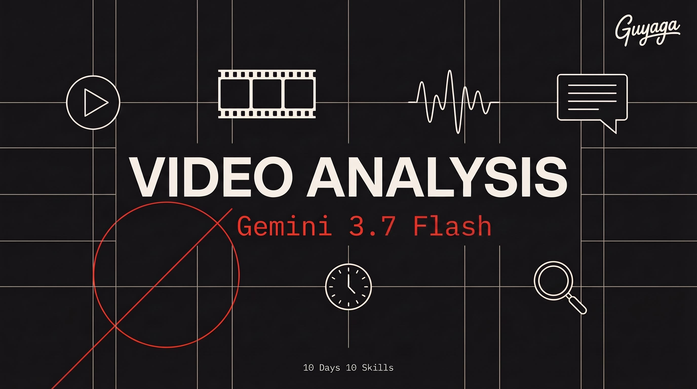

<p align="center">
  
</p>

<h1 align="center">Day 2 — AI Video Analyzer</h1>
<p align="center">
  <strong>10 Days 10 Skills</strong> · Claude Code Course by <a href="https://bestguy.ai">Guy Aga</a>
</p>
<p align="center">
  
  
  
</p>

---

## What is This?

This skill lets you **analyze any video or audio** directly from Claude Code. Just give it a file or a YouTube link, and it tells you everything: what happens, what people say, scene breakdowns, timestamps, emotions, and more.

No video editing software needed. No technical knowledge required.

### What Can You Do With It?

- **"What happens in this video?"** — get a full scene-by-scene breakdown
- **"Transcribe this"** — speech to text with timestamps and speaker detection
- **"Review my ad"** — get professional feedback on your marketing video
- **"Create subtitles"** — generate SRT caption files for social media
- **"Help me edit this"** — get exact timestamps and ffmpeg commands
- **"Check this AI video"** — spot artifacts in Seedance/Veo generated videos
- **"Analyze this podcast"** — transcribe and summarize audio recordings
- **"What did they say at 1:23?"** — ask about specific moments

### Why Gemini 3.7 Flash?

| Feature | What It Means for You |
|---------|----------------------|
| **Fast & affordable** | Tested head-to-head against Gemini 3.1 Pro on real videos — equal or better analysis, 1.3–2.6× faster, ~¼ the price |
| **Video + Audio** | Understands both what you see AND what you hear |
| **1 million token context** | Can process videos up to 1 hour long |
| **YouTube URLs** | Analyze any public YouTube video without downloading |
| **Timestamps** | Ask about specific moments (MM:SS format) |
| **Emotion detection** | Knows if the speaker sounds happy, sad, angry, or neutral |
| **Structured output** | Get results as JSON for automation |
| **Custom FPS** | Adjust analysis detail — more frames for action, fewer for lectures |
| **Audio formats** | MP3, WAV, AAC, FLAC, OGG, AIFF |

---

## Prerequisites

Before you start, make sure you have:

- [ ] **Claude Code** installed (Pro or Max subscription)
- [ ] **Node.js 20+** installed on your computer
- [ ] A **Google AI Studio** account
- [ ] A **Gemini API Key** (pay-as-you-go pricing)

> **Same API key as Day 1!** If you already have a GEMINI_API_KEY from the Image Generation lesson, you're good — it works for video analysis too.

---

## Step 1: Get Your API Key

If you already did this in Day 1, skip to Step 2.

1. Go to [Google AI Studio](https://aistudio.google.com/apikey)
2. Click **"Create API Key"**
3. Copy your API key

> **Pay-as-you-go pricing.** Set up a [Google Cloud billing profile](https://console.cloud.google.com/billing). Gemini 3.7 Flash costs $0.75 per 1M input tokens (through 2026, then $1.50). Start with **$5-10 in credits** — that's plenty for learning.

---

## Step 2: Set Up Your Environment

```bash
# Windows (PowerShell)
$env:GEMINI_API_KEY="your-api-key-here"

# macOS / Linux
export GEMINI_API_KEY=your-api-key-here
```

---

## Step 3: Install the Skill

### The Easy Way (Recommended)

Open Claude Code and paste this:

```
Install the ai-video-analyzer skill from https://github.com/guyaga/10d10s-day02-video-analyzer and set up everything I need to analyze videos with Gemini 3.7 Flash. Install the @google/genai SDK.
```

Claude handles everything — cloning, installing, configuring.

### Manual Way (if you prefer)

```bash
# Install the SDK
npm install @google/genai

# Clone the skill
cd ~/.claude/skills/
git clone https://github.com/guyaga/10d10s-day02-video-analyzer ai-video-analyzer
```

---

## How to Use It

### Analyze a Local Video

Just tell Claude Code:

```
Analyze the video at D:/Videos/my-ad.mp4 — give me a scene breakdown, transcription, and feedback on the ad quality
```

### Analyze a YouTube Video

```
Analyze this YouTube video: https://www.youtube.com/watch?v=VIDEO_ID
Tell me what the hook is, what makes it engaging, and give me a replicable formula
```

### Transcribe Audio

```
Transcribe the audio file at D:/Recordings/meeting.mp3
Include timestamps, speaker detection, and a summary
```

### Get Editing Commands

```
I have a video at D:/Videos/raw-footage.mp4
Analyze it and give me ffmpeg commands to:
- Remove the first 5 seconds (intro)
- Cut out the silence between 1:30 and 2:00
- Export a 15-second highlight clip
```

### Create Subtitles

```
Generate SRT subtitles for the video at D:/Videos/reel.mp4
Keep captions short (max 2 lines) and sync to speech
```

### Review AI-Generated Video

```
Check this AI-generated video at D:/Videos/seedance-output.mp4 for quality issues
Look for artifacts, unnatural movements, and face consistency
```

---

## Three Ways to Input Video

| Method | When to Use | How |
|--------|-------------|-----|
| **Local file** | Your video is on your computer | Just give the file path |
| **YouTube URL** | It's a public YouTube video | Paste the URL |
| **Small clip inline** | File is under 100MB and short | Claude handles this automatically |

Claude Code picks the right method for you — you don't need to think about it.

---

## What the AI Understands

| Aspect | Details |
|--------|---------|
| **Visual** | Objects, people, text, colors, movements, transitions, scene changes |
| **Audio** | Speech, music, sound effects, silence, background noise |
| **Temporal** | What happens when, scene duration, pacing |
| **Emotional** | Speaker mood, content tone, audience impact |
| **Technical** | Resolution quality, frame rate feel, editing quality |

---

## Supported File Formats

**Video:** MP4, MPEG, MOV, AVI, FLV, MPG, WebM, WMV, 3GPP

**Audio:** WAV, MP3, AIFF, AAC, OGG Vorbis, FLAC

---

## Tips for Better Results

1. **Be specific** about what you want — "analyze the hook and CTA" beats "tell me about this video"
2. **Use timestamps** — "what happens at 01:45?" gives focused answers
3. **One video per request** — don't send multiple videos at once
4. **Short clips first** — if your video is 30+ minutes, analyze it in segments
5. **Ask for JSON** if you need structured data for automation

---

## Troubleshooting

| Problem | Solution |
|---------|----------|
| "API key not found" | Set `GEMINI_API_KEY` in your terminal (see Step 2) |
| "File too large" | The skill uses File API automatically for large files — just wait for upload |
| "Video processing failed" | File might be corrupted. Try converting with `ffmpeg -i input.mp4 output.mp4` |
| "Rate limit exceeded" | Wait a few minutes and try again, or check your billing quota |
| YouTube not working | Only public videos work. Private/unlisted videos are blocked |

---

## Links

- [Google AI Studio — Get API Key](https://aistudio.google.com/apikey)
- [Gemini API Pricing](https://ai.google.dev/pricing)
- [Gemini Video Understanding Docs](https://ai.google.dev/gemini-api/docs/video-understanding)
- [Gemini Audio Understanding Docs](https://ai.google.dev/gemini-api/docs/audio)
- [Course Page — bestguy.ai](https://bestguy.ai/course/10-days-10-skills)
- [HTML Skill Guide (Hebrew)](https://bestguy.ai/course/guides/day02-video-analyzer.html)

---

<p align="center">
  <strong>10 Days 10 Skills</strong> — Claude Code Course<br>
  <a href="https://bestguy.ai">bestguy.ai</a> · Guy Aga © 2026
</p>
